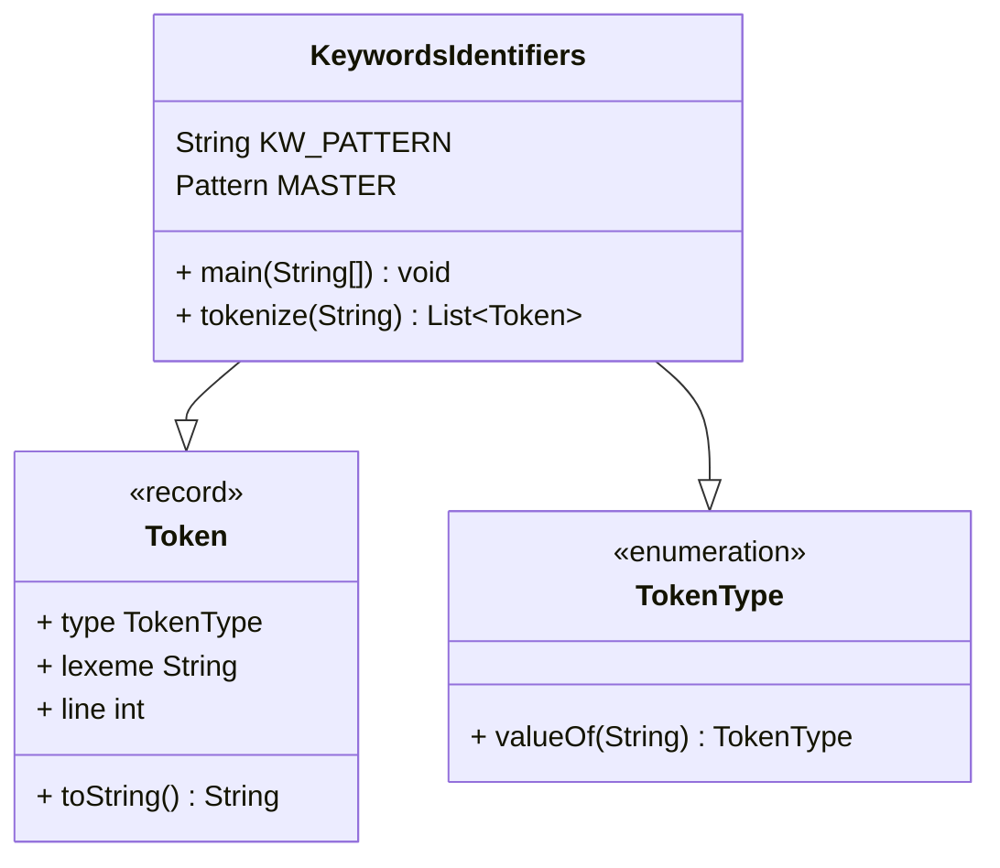

# Análisis Léxico en Java — Patrones, Lexemas y Tokens

> **Curso:** Autómatas y Compiladores — Unidad 2  
> **Duración:** 2 horas · 4 casos prácticos · Expresiones Regulares  
> **Meta:** Que los alumnos construyan su propio analizador léxico de códigos de Java

---

## 00 · Plan de Sesión

| Tiempo | Tipo | Actividad |
|--------|------|-----------|
| 00:00 – 00:15 | 🎯 Teoría | Introducción y objetivos. Posición del análisis léxico en el compilador. |
| 00:15 – 00:40 | 📖 Teoría | Marco teórico: tokens, lexemas, patrones y expresiones regulares. |
| 00:40 – 01:00 | 💻 Práctica | **Caso 1 + Caso 2** — Keywords, identifiers, operadores y separadores. |
| 01:00 – 01:05 | ☕ Pausa | Breve receso. Los alumnos verifican resultados. |
| 01:05 – 01:35 | ⚙️ Práctica | **Caso 3 + Caso 4** — Literales numéricos, strings, comentarios y errores. |
| 01:35 – 01:55 | 🔧 Práctica | Integración: construyendo el Lexer completo. |
| 01:55 – 02:00 | 💬 Discusión | Cierre y asignación del proyecto final. |

### Objetivos de Aprendizaje

- Distinguir **token**, **lexema** y **patrón** en código Java real.
- Escribir expresiones regulares (ER) para cada categoría léxica.
- Implementar un Lexer funcional usando `java.util.regex`.
- Detectar y reportar errores léxicos con número de línea y columna.
- Comprender la relación ER ↔ AFD ↔ Tabla de transición.

### Materiales Necesarios

- JDK 17+ instalado (OpenJDK u Oracle)
- IDE: IntelliJ IDEA Community o VS Code + Java Extension Pack
- Archivo de prueba `Ejemplo.java`
- Papel y lápiz para diagramas de autómatas finitos

---

## 01 · Marco Teórico

### Los tres conceptos clave

| Concepto | Definición | Ejemplo |
|----------|-----------|---------|
| **Token** | Par `(tipo, valor)` que representa una unidad léxica con significado. Es el *output* del analizador léxico hacia el parser. | `⟨KEYWORD, "class"⟩` |
| **Lexema** | Secuencia de caracteres del código fuente que *coincide* con el patrón de un token. Es la cadena cruda leída del archivo. | `"class"`, `"MiClase"`, `"123"` |
| **Patrón** | Regla (expresión regular) que describe el conjunto de cadenas válidas para un token. Define *qué forma* puede tener. | `[a-zA-Z_][a-zA-Z0-9_]*` |

### Categorías de Tokens en Java

| Categoría       | Ejemplos de lexemas |
|-----------------|-------------------|
| `KEYWORD`       | `class` `if` `while` `return` `int` `void` `new` `public` `static` |
| `IDENTIFIER`    | `miVariable` `_count` `MiClase` `$precio` |
| `INTEGER_LIT`   | `42` `0` `1_000_000L` |
| `FLOAT_LIT`     | `3.14` `1.5f` `2.5e-3d` |
| `STRING_LIT`    | `"Hola\nMundo"` `""` |
| `CHAR_LIT`      | `'a'` `'\n'` `'\u0041'` |
| `OPERATOR`      | `+` `-` `*` `==` `!=` `&&` `++` `<=` |
| `SEPARATOR`     | `(` `)` `{` `}` `[` `]` `;` `,` |
| `LINE_COMMENT`  | `// esto es un comentario` |
| `BLOCK_COMMENT` | `/* bloque */` |

### Tabla de Patrones (Expresiones Regulares)

| Token | Expresión Regular | Descripción |
|-------|------------------|-------------|
| `KEYWORD` | `\b(class\|if\|else\|while\|for\|return\|int\|double\|boolean\|void\|new\|public\|private\|static\|final\|...)\b` | Palabras reservadas — el `\b` es esencial |
| `IDENTIFIER` | `[a-zA-Z_$][a-zA-Z0-9_$]*` | Letra/`_`/`$` seguido de letras, dígitos o `_` |
| `INTEGER_LIT` | `0\|[1-9][0-9_]*[lL]?` | Decimal: `42`, `1_000_000L` |
| `FLOAT_LIT` | `[0-9][0-9_]*\.[0-9][0-9_]*([eE][+-]?[0-9]+)?[fFdD]?` | Flotante con punto decimal, exponente y sufijo opcionales |
| `STRING_LIT` | `"([^"\\]\|\\.)* "` | Cadena con secuencias de escape |
| `CHAR_LIT` | `'([^'\\]\|\\.)'` | Carácter: `'a'`, `'\n'` |
| `OPERATOR` | `==\|!=\|<=\|>=\|&&\|\|\|\|<<\|>>\|++\|--\|[+\-*/%<>=!&\|^~]` | Compuestos primero, luego simples |
| `SEPARATOR` | `[(){}\[\];,.]` | Delimitadores y puntuación |
| `LINE_COMMENT` | `//[^\n]*` | Desde `//` hasta fin de línea |
| `BLOCK_COMMENT` | `/\*[\s\S]*?\*/` | Entre `/*` y `*/` |
| `WHITESPACE` | `[ \t\r\n]+` | Se consume y se ignora (pero cuenta líneas) |

### Reglas de Prioridad (el orden importa)

1. **Comentarios** (`//` y `/* */`) — contienen caracteres que podrían confundir
2. **Literales de cadena y char** — pueden contener cualquier carácter
3. **Literales numéricos**: FLOAT antes que INT; HEX/BIN/OCT antes que decimal
4. **KEYWORD** antes que **IDENTIFIER** — `while` no debe ser un identificador
5. **Operadores compuestos** antes que simples — `==` no es `=` + `=`
6. **Separadores**
7. **Whitespace** — descartar al final

> **Principio de maximal munch:** el analizdor léxico siempre consume el lexema más largo posible. Así `integer` es un `IDENTIFIER`, no `KEYWORD("int") + IDENTIFIER("eger")`.

---

## 02 · Caso 1 — Básico: Keywords e Identifiers

**Nivel:** Básico - **Tiempo estimado:** 20 min

### Objetivo

Dado un fragmento de código Java, identificar y clasificar cada lexema como `KEYWORD` o `IDENTIFIER`, usando expresiones regulares con la API `Pattern`/`Matcher` de Java.

### Patrones

| Token | Expresión Regular | Nota |
|-------|------------------|------|
| `KEYWORD` | `\b(abstract\|assert\|boolean\|break\|...\|while\|true\|false\|null)\b` | El `\b` (word boundary) es esencial |
| `IDENTIFIER` | `[a-zA-Z_$][a-zA-Z0-9_$]*` | Solo si NO coincidió con KEYWORD |

### Concepto Clave: Word Boundary `\b`

Sin `\b`, el patrón `int` coincidiría dentro de `integer`, tokenizándolo incorrectamente como `KEYWORD("int") + IDENTIFIER("eger")`. El boundary garantiza que `int` solo coincida como palabra completa.

### Implementación en Java

La implementación del analizador léxico se basa en el siguiente diagrma de clases:


```java
import java.util.regex.*;
import java.util.*;

public class KeywordsIdentifiers {

    // Tipos de token
    enum TokenType { KEYWORD, IDENTIFIER, WHITESPACE, UNKNOWN }

    // Record para representar un Token (Java 16+)
    record Token(TokenType type, String lexeme, int line) {
        public String toString() {
            return String.format("[L%-3d] %-14s → \"%s\"", line, type, lexeme);
        }
    }

    // Patrón de keywords (todas las palabras reservadas de Java)
    static final String KW_PATTERN =
        "\\b(abstract|assert|boolean|break|byte|case|catch|char|" +
        "class|const|continue|default|do|double|else|enum|extends|" +
        "final|finally|float|for|if|implements|import|instanceof|" +
        "int|interface|long|new|package|private|protected|public|" +
        "return|short|static|super|switch|synchronized|this|throw|" +
        "throws|try|void|volatile|while|true|false|null)\\b";

    // Patrón MASTER con grupos nombrados
    static final Pattern MASTER = Pattern.compile(
        "(?<KEYWORD>"    + KW_PATTERN                   + ")|" +
        "(?<IDENTIFIER>" + "[a-zA-Z_$][a-zA-Z0-9_$]*"   + ")|" +
        "(?<WHITESPACE>" + "[ \\t\\r\\n]+"              + ")"
    );

    // Método de Tokenización
    public static List<Token> tokenize(String source) {
        List<Token> tokens = new ArrayList<>();
        Matcher m = MASTER.matcher(source);
        int line = 1, pos = 0;

        while (m.find()) {
            // Detectar caracteres no reconocidos
            if (m.start() > pos) {
                String unknown = source.substring(pos, m.start());
                tokens.add(new Token(TokenType.UNKNOWN, unknown, line));
            }
            if (m.group("WHITESPACE") != null) {
                // Contar saltos de línea en el whitespace
                line += m.group("WHITESPACE").chars().filter(c -> c == '\n').count();
            } else if (m.group("KEYWORD") != null) {
                tokens.add(new Token(TokenType.KEYWORD, m.group(), line));
            } else if (m.group("IDENTIFIER") != null) {
                tokens.add(new Token(TokenType.IDENTIFIER, m.group(), line));
            }
            pos = m.end();
        }
        return tokens;
    }

    public static void main(String[] args) {
        String source = """
            public class MiClase {
                private int contador;
                public void incrementar() {
                    contador++;
                }
            }
            """;
        tokenize(source).forEach(System.out::println);
    }
}
```

### Salida Esperada

```
[L1 ] KEYWORD        → "public"
[L1 ] KEYWORD        → "class"
[L1 ] IDENTIFIER     → "MiClase"
[L2 ] KEYWORD        → "private"
[L2 ] KEYWORD        → "int"
[L2 ] IDENTIFIER     → "contador"
[L3 ] KEYWORD        → "public"
[L3 ] KEYWORD        → "void"
[L3 ] IDENTIFIER     → "incrementar"
```

### ⚡ Actividad (5 min)

Modifica variable `source` para incluir: `integer`, `forLoop`, `returnValue`. Verifica que el lexer los clasifique como `IDENTIFIER`. 

¿Por qué ocurre eso? Explica el rol de `\b`.

### 💬 Preguntas de Discusión

1. ¿Qué pasa si eliminas los `\b` del patrón KEYWORD?
2. ¿Por qué el patrón KEYWORD debe evaluarse antes que IDENTIFIER?
3. ¿Podrías construir una sola ER que reconozca ambos tokens a la vez?

---

## 03 · Caso 2 — Básico+: Operadores y Separadores

**Nivel:** Básico+ · **Tiempo estimado:** 20 min

### Objetivo

Reconocer operadores simples y compuestos junto a separadores. Comprender y resolver el **problema del prefijo** con alternancia ordenada.

### El Problema del Prefijo

Si el patrón es `[+\-*/%<>=!]` y el código tiene `==`, la ER identificará `=` y luego otro `=` por separado → **dos tokens incorrectos**. 

**Solución:** colocar los operadores más largos primero:

```
==|!=|<=|>=|&&|\|\||<<|>>>|>>|\+\+|--|...  antes que  =|<|>|!|+|-|...
```

### Patrones de operadores y separadores

| Token | Expresión Regular |
|-------|------------------|
| `OPERATOR` | `==\|!=\|<=\|>=\|&&\|\|\|\|<<\|>>>\|>>\|\+\+\|--\|+=\|-=\|*=\|/=\|[+\-*/%<>=!&\|^~?:]` |
| `SEPARATOR` | `[(){}\[\];,.]` |

### Implementación — Extensión del Caso 1

```java
// Agregar a la cadena MASTER del Caso 1:

static final Pattern MASTER = Pattern.compile(
    "(?<KEYWORD>"  + KW_PATTERN                       + ")|" +
    "(?<IDENTIFIER>"    + "[a-zA-Z_$][a-zA-Z0-9_$]*"      + ")|" +
    // Operadores: 2-3 caracteres PRIMERO, luego simples
    "(?<OPERATOR>"       +
        "==|!=|<=|>=|&&|\\|\\||<<|>>>|>>|\\+\\+|--|" +
        "\\+=|-=|\\*=|/=|%=|&=|\\|=|\\^=|<<=|>>=|" +
        "[+\\-*/%<>=!&|^~?:]"                         +
    ")|" +
    "(?<SEPARATOR>"      + "[(){}\\[\\];,.]"                + ")|" +
    "(?<WHITESPACE>"       + "[ \\t\\r\\n]+"                  + ")"
);

// En el bucle while, agregar:
else if (m.group("OPERATOR")  != null)
    tokens.add(new Token(TokenType.OPERATOR,  m.group(), line));
else if (m.group("SEPARATOR") != null)
    tokens.add(new Token(TokenType.SEPARATOR, m.group(), line));
```

### Ejemplo de Tokenización

Cambia la variable `source`  por : `a == b && c != d || i++ <= 10`

### Salida Esperada

```
IDENTIFIER  → "a"
OPERATOR    → "=="    ← NO "=" + "="
IDENTIFIER  → "b"
OPERATOR    → "&&"    ← operador compuesto
IDENTIFIER  → "c"
OPERATOR    → "!="
IDENTIFIER  → "d"
OPERATOR    → "||"
IDENTIFIER  → "i"
OPERATOR    → "++"    ← maximal munch: ++ no es + +
OPERATOR    → "<="
INTEGER_LIT → "10"
```

### ⚡ Actividad (5 min)

- Tokeniza la expresión: `x = (a + b) * 3 - c[i];`
- Escribe el listado de tokens resultante en papel.
- Experimenta invirtiendo el orden de los operadores (simples antes que compuestos), ¿qué errores que identificas?.

### 💬 Preguntas de Discusión

1. ¿Cómo manejarías el operador ternario `?:` en tu analizador?
2. El operador `>>>` (shift sin signo) debe reconocerse antes que `>>`. ¿Por qué?
3. ¿Qué diferencia hay entre un separador y un operador desde la perspectiva de la gramática?

---

## 04 · Caso 3 — Intermedio: Literales Numéricos y de Cadena

**Nivel:** Intermedio · **Tiempo estimado:** 20 min

### Objetivo

Construir patrones que reconozcan la variedad de literales de Java: enteros decimales, hexadecimales, octales, binarios, flotantes con notación científica y literales de cadena con secuencias de escape.

### Patrones ER para Literales Numéricos

| Token             | Expresión Regular | Ejemplo |
|-------------------|------------------|---------|
| `FLOAT_LIT`       | `[0-9][0-9_]*\.[0-9][0-9_]*([eE][+-]?[0-9]+)?[fFdD]?` | `3.14` `1_000.0f` `2.5e-3d` |
| `HEXADECIMAL_LIT` | `0[xX][0-9a-fA-F][0-9a-fA-F_]*[lL]?` | `0xFF` `0xDEAD_BEEF` |
| `BINARY_LIT`      | `0[bB][01][01_]*[lL]?` | `0b1010` `0B1111_0000` |
| `OCTAL_LIT`       | `0[0-7]+[lL]?` | `0777` `0644` |
| `INTEGER_LIT`     | `0\|[1-9][0-9_]*[lL]?` | `42` `1_000_000L` |
| `STRING_LIT`      | `"([^"\\]\|\\.)*"` | `"Hola\nMundo"` |
| `CHAR_LIT`        | `'([^'\\]\|\\.)'` | `'a'` `'\n'` `'\u0041'` |

> **Nota Java 7+:** Los guiones bajos en literales numéricos (`1_000_000`) son válidos. El patrón `[0-9][0-9_]*` los acepta. El orden obligatorio es: FLOAT antes de INT, y HEX/BIN/OCT antes del decimal (todos comienzan con `0`).

### Implementación

Agregar grupo de `LITERALES` a `Patter MASTER`

```java
    "(?<FLOATLIT>[0-9][0-9_]*\\.[0-9][0-9_]*([eE][+-]?[0-9]+)?[fFdD]?)|" +
    "(?<HEXADECIMALLIT>0[xX][0-9a-fA-F][0-9a-fA-F_]*[lL]?)|" +
    "(?<BINARYLIT>0[bB][01][01_]*[lL]?)|" +
    "(?<OCTALLIT>0[0-7]+[lL]?)|" +
    "(?<INTEGERLIT>0|[1-9][0-9_]*[lL]?)|" +
    "(?<STRINGLIT>\"([^\"\\\\]|\\\\.)*\")|" +
    "(?<CHARLIT>'([^'\\\\]|\\\\.)')"
```

Agregar condiciones al bucle `while`

```java
// En el bucle while, agregar:
else if (m.group("FLOATLIT") != null)
    tokens.add(new Token(TokenType.FLOATLIT, m.group(), line));
else if (m.group("HEXADECIMALLIT")   != null)
    tokens.add(new Token(TokenType.HEXADECIMALLIT, m.group(), line));
else if (m.group("BINARYLIT")   != null)
    tokens.add(new Token(TokenType.BINARYLIT, m.group(), line));
else if (m.group("OCTALLIT")   != null)
    tokens.add(new Token(TokenType.OCTALLIT, m.group(), line));
else if (m.group("INTEGERLIT")   != null)
    tokens.add(new Token(TokenType.INTEGERLIT, m.group(), line));
else if (m.group("STRINGLIT")   != null)
    tokens.add(new Token(TokenType.STRINGLIT, m.group(), line));
else if (m.group("CHARLIT")  != null)
    tokens.add(new Token(TokenType.CHARLIT, m.group(), line));
```

### Ejemplo de Tokenización

Cambia la variable `source` por el siguiente código Java:

```java
int    a  = 255;
int    b  = 0xFF;
int    c  = 0b1111_0000;
double pi = 3.14159;
String s  = "hola\n";
```
### Salida esperada

```
INTEGERLIT      → "255"
HEXADECIMALLIT  → "0xFF"
BINARYLIT       → "0b1111_0000"
FLOATLIT        → "3.14159"
STRINGLIT       → "\"hola\\n\""
```

### ⚡ Actividad (5 min)

- Tokeniza: `long max = 9_223_372_036_854_775_807L;`
- Prueba que `0.5f` sea reconocido como `FLOATLIT` y no como `INTEGERLIT("0") + SEPARATOR(".") + IDENTIFIER("5f")`.
- ¿Qué ocurre con `"cadena sin cerrar`? Modifica el patrón para reportar un error.

### 💬 Preguntas de Discusión

1. ¿Por qué `08` NO es un octal válido en Java? ¿Cómo ajustarías la ER?
2. ¿Cómo extenderías el patrón STRING para soportar Text Blocks de Java 15+ (`"""..."""`)?
3. ¿Tiene sentido que el analizador léxico verifique si un número está en rango (e.g., `int > 2^31`)?

---

## 05 · Caso 4 — Intermedio: Comentarios y Errores Léxicos

**Nivel:** Intermedio · **Tiempo estimado:** 20 min

### Objetivo

Reconocer y descartar comentarios (de línea y de bloque), manejar whitespace con conteo de líneas y reportar errores léxicos con línea y columna cuando se encuentra un carácter no reconocido.

### Patrones ER para Comentarios

| Token | Expresión Regular | Trampa común |
|-------|------------------|-------------|
| `JAVADOC` | `/\*\*[\s\S]*?\*/` | Evaluar **antes** que `BLOCKCOMMENT` |
| `BLOCKCOMMENT` | `/\*[\s\S]*?\*/` | El `*?` **no-greedy** es crítico. Sin él, `/* a */ b /* c */` se consume entero. |
| `LINECOMMENT` | `//[^\n]*` | `[^\n]*` consume hasta (sin incluir) el salto de línea |

### Implementación del Manejo de Errores

```java
/**
 * Excepción para errores léxicos — contiene línea y columna exactas
 */
public class LexicalError extends RuntimeException {
    private final int line, column;
    private final char illegal;

    public LexicalError(char c, int line, int col) {
        super(String.format(
            "Error léxico [línea %d, col %d]: carácter ilegal '%c' (U+%04X)",
            line, col, c, (int) c
        ));
        this.line = line; this.column = col; this.illegal = c;
    }
}

// En el tokenizador — estrategia PANIC RECOVERY:
// Si queda texto sin consumir, avanzar 1 char, registrar el error y continuar.

if (m.start() > pos) {
    String illegal = source.substring(pos, m.start());
    int col = pos - source.lastIndexOf('\n', pos);
    System.err.printf("Error léxico [L%d, C%d]: '%s'%n", line, col, illegal);
    errors.add(new LexicalError(illegal.charAt(0), line, col));
}
```

### Patrón MASTER Final — Integración de los 4 Casos

```java
static final Pattern MASTER = Pattern.compile(
        // 1. Comentarios primero (no producen tokens de salida)
        "(?<JAVADOC>/\\*\\*[\\s\\S]*?\\*/)|"   +
        "(?<BLOCKCOMMENT>/\\*[\\s\\S]*?\\*/)|"     +
        "(?<LINECOMMENT>//[^\\n]*)|"              +
        // 2. Literales de cadena y char (contienen cualquier carácter)
        "(?<STRINGLIT>\"([^\"\\\\]|\\\\.)*\")|"      +
        "(?<CHARLIT>'([^'\\\\]|\\\\.)')|"         +
        // 3. Literales numéricos (FLOAT > HEX/BIN/OCT > INT)
        "(?<FLOATLIT>[0-9][0-9_]*\\.[0-9][0-9_]*([eE][+-]?[0-9]+)?[fFdD]?)|" +
        "(?<HEXADECIMALLIT>0[xX][0-9a-fA-F][0-9a-fA-F_]*[lL]?)|" +
        "(?<BINARYLIT>0[bB][01][01_]*[lL]?)|"       +
        "(?<OCTALLIT>0[0-7]+[lL]?)|"               +
        "(?<INTEGERLIT>0|[1-9][0-9_]*[lL]?)|"        +
        // 4. Keywords antes que dentificadores
        "(?<KEYWORD>" + KW_PATTERN + ")|"           +
        "(?<IDENTIFIER>[a-zA-Z_$][a-zA-Z0-9_$]*)|" +
        // 5. Operadores compuestos antes que simples
        "(?<OPERATOR>==|!=|<=|>=|&&|\\|\\||<<|>>>|>>|\\+\\+|--|\\+=|-=|\\*=|/=|[+\\-*/%<>=!&|^~?:])|" +
        // 6. Separadores
        "(?<SEPARATOR>[(){}\\[\\];,.])|"             +
        // 7. Whitespace (descartar)
        "(?<WHITESPACE>[ \\t\\r\\n]+)",
        Pattern.MULTILINE
);
```

### Salida del Lexer Completo

Cambia la variable `source` por el siguiente código Java:

```java
/** JavaDoc comment */
public class Prueba {
    public static void main(String[] args) {
        int x = 0xFF;    // hex
        double pi = 3.14;
        String s = "mundo";
        if (x == 255 && pi > 0.0) { x++; }
        @  // ← error léxico intencional
    }
}
```

### Salida esperada

```
[L2 ] JAVADOC      → "/** JavaDoc comment */"
[L3 ] KEYWORD      → "public"
[L3 ] KEYWORD      → "class"
[L3 ] IDENTIFIER   → "Prueba"
[L4 ] KEYWORD      → "public"
[L4 ] KEYWORD      → "static"
[L4 ] KEYWORD      → "void"
[L4 ] IDENTIFIER   → "main"
[L5 ] HEX_LIT      → "0xFF"
[L6 ] FLOAT_LIT    → "3.14"
[L7 ] STRING_LIT   → "\"mundo\""
[L8 ] OPERATOR     → "=="
[L8 ] OPERATOR     → "&&"
[L8 ] OPERATOR     → ">"
[L8 ] OPERATOR     → "++"
⚠ Error léxico [L9, C9]: '@' (U+0040)
```

### ⚡ Actividad Final (10 min)

1. Integra los 4 casos en una clase `JavaLexer.java`.
2. Prueba con el archivo `Ejemplo.java` del repositorio del curso.
3. Genera una tabla de frecuencia: ¿cuántos tokens de cada tipo hay?
4. **Bonus:** guarda la salida en formato CSV (`línea,tipo,lexema`).

### 💬 Preguntas de Discusión

1. ¿Cómo manejaría tu lexer un comentario de bloque no cerrado al final del archivo?
2. ¿Deberían los JavaDoc comments producir un token diferente a los block comments?
3. ¿Cuál es la diferencia entre recuperación de errores en el **lexer** vs en el **parser**?

---

## 06 · Proyecto Final

### Descripción

Construir un analizador léxico completo para el subconjunto de Java cubierto en clase. El lexer debe leer un archivo `.java` y producir una tabla de tokens con número de línea y columna.

### Entregables

- Código fuente `JavaLexer.java`
- Archivo de prueba `Ejemplo.java` con mínimo 100 líneas y 50+ tokens
- Reporte PDF: decisiones de diseño y resultados de pruebas
- Demo en vivo (5 minutos por estudiante)

### Fases del Proyecto

| Fase                                        | Descripción                                                                                                                                 |
|---------------------------------------------|---------------------------------------------------------------------------------------------------------------------------------------------|
| **1. Definición de Tokens y ER**            | Tabla completa de tokens Java con su expresión regular. Justificar el orden de evaluación.                                                  |
| **2. Implementación del Analizador Léxico** | Clase `JavaLexer` con método `tokenize(String src)` que retorna `List<Token>`. La clase `Token` debe incluir tipo, lexema, línea y columna. |
| **3. Manejo de Errores**                    | Recolectar todos los errores léxicos sin detener el proceso. Reportar lista final con ubicación precisa.                                    |
| **4. Pruebas y Validación**                 | Casos de prueba unitarios (JUnit) por categoría. Prueba de integración con un archivo Java real de mínimo 100 líneas y 50+ tokens.          |
| **5. Extensiones Opcionales**               | Text Blocks (Java 15+), anotaciones (`@Override`), tabla HTML coloreada, exportación CSV para análisis estadístico.                         |

### Rúbrica de Evaluación

| Criterio | Puntaje | Descripción |
|----------|---------|-------------|
| Correctitud | 30 pts | Todos los tokens Java básicos reconocidos, sin falsos positivos |
| Expresiones Regulares | 25 pts | ER correctas, sin ambigüedades, bien documentadas y con orden justificado |
| Manejo de Errores | 20 pts | Recuperación sin crash, reporte claro con línea y columna |
| Pruebas | 15 pts | Cobertura de casos borde: strings con escapes, hex, comentarios mal cerrados |
| Calidad del Código | 10 pts | Legibilidad, JavaDoc, separación de responsabilidades |
| **Total** | **100 pts** | |

### Recursos Recomendados

**Bibliografía:**
- Aho, Lam, Sethi, Ullman — *Compilers: Principles, Techniques and Tools* (Dragon Book), Cap. 3
- Robert Nystrom — *Crafting Interpreters* (gratuito en línea), Cap. 3-4
- *Java Language Specification* (JLS) — §3 Lexical Structure
- `java.util.regex` — Javadoc oficial de `Pattern` y `Matcher`

**Herramientas:**
- [regex101.com](https://regex101.com) — Probar ER con explicación paso a paso
- [regexr.com](https://regexr.com) — Alternativa visual con referencia rápida
- **Flex** — Generador de lexers para C (para comparación)

---

> **Nota del profesor:** El analizador léxico que construyas te permitirá implementar los conceptos teóricos de la unidad y servirá de base para los siguientes proyectos.
