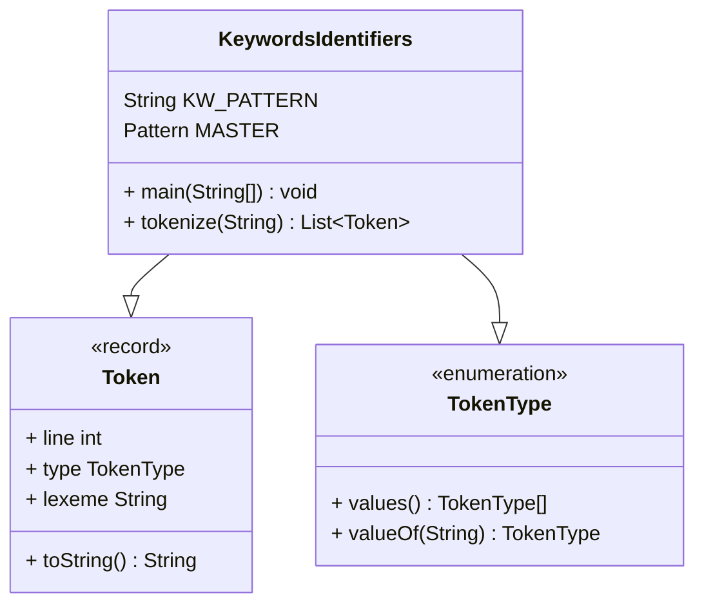

```mermaid
classDiagram
class KeywordsIdentifiers {
    String KW_PATTERN
    Pattern MASTER
    + main(String[]) void
    + tokenize(String) List~Token~
  }
  class Token { 
    <<record>>
    + toString() String
    + line int
    + type TokenType
    + lexeme String
  }
  class TokenType {
  <<enumeration>>
    + values() TokenType[]
    + valueOf(String) TokenType
  }

KeywordsIdentifiers  --|>  Token
KeywordsIdentifiers  --|>  TokenType
```
