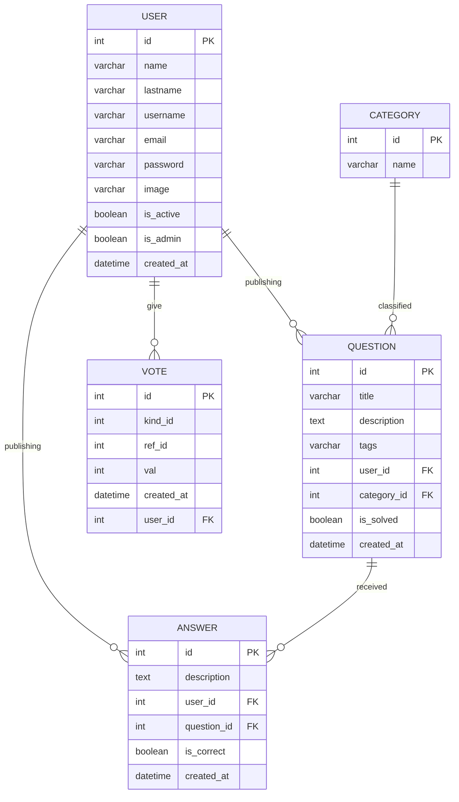

# Questions Database
_______________________________

📌 Create database, tables, and querys

**Instructions**.

For this lab, the **questionBD** database is used to build the queries.
These lab is based on the following relational model.

